# Git Multi-Account Manager — System Architecture

> **Decided Architecture: Microkernel + Hexagonal Core**
> **Language Stack: Rust (core runtime) + Zig (native OS layer) + TypeScript/Svelte (frontend)**
>
> This document explains how every component of the system works, why it exists, and how it connects to everything else. It covers the complete hybrid architecture including the Rust–Zig interop boundary, the FFI contract between them, and exactly where each language is responsible. Read top-to-bottom once, then use the diagrams as reference maps.

---

## Table of Contents

1. [Why Microkernel + Hexagonal?](#1-why-microkernel--hexagonal)
2. [Top-Level System Overview](#2-top-level-system-overview)
3. [Kernel Layer](#3-kernel-layer)
4. [Domain Layer](#4-domain-layer)
5. [Ports — Inbound and Outbound](#5-ports--inbound-and-outbound)
6. [Plugin Layer](#6-plugin-layer)
7. [Adapter Layer](#7-adapter-layer)
8. [Zig Native Layer](#8-zig-native-layer)
9. [Shared Layer](#9-shared-layer)
10. [Complete Folder Structure](#10-complete-folder-structure)
11. [Every File Explained](#11-every-file-explained)
12. [Full Request Lifecycle Flows](#12-full-request-lifecycle-flows)
13. [Database Relationship Map](#13-database-relationship-map)
14. [Event Flow Map](#14-event-flow-map)

---

## 1. Why Microkernel + Hexagonal?

Before looking at any code, you need to understand why this combination was chosen — because if you do not understand the *why*, you will start placing code in the wrong places and the architecture will collapse silently over time.

The project is NOT a web application. It is a **developer platform runtime**. The difference is crucial. A web application has a fixed set of features: routes, controllers, models, views. A platform runtime has a **stable core** and an **infinite set of possible extensions**. Git Manager will eventually support GitHub, GitLab, Bitbucket, Azure DevOps, Gitea, self-hosted instances, AI assistants, automation, analytics plugins, and custom providers nobody has invented yet.

Layered architecture fails here because it assumes a linear dependency chain (UI → Business → Data) and has no concept of plugins. Clean Architecture and Hexagonal Architecture alone are excellent at isolating business logic from infrastructure, but they do not naturally answer: *how do you add a new Git provider without touching the core?* Microservices fragment the runtime, which is catastrophic for a tool where all Git operations share a common execution engine, SSH agent, and credential vault.

**Microkernel** solves the extensibility problem. The kernel is tiny and stable — it only manages plugin lifecycles, command routing, event dispatching, and workflow orchestration. Every feature beyond that lives in a plugin. This is exactly how Eclipse, VS Code, IntelliJ IDEA, and Jenkins work.

**Hexagonal Architecture inside the kernel** solves the isolation problem. The kernel and domain never directly touch GitHub's API or the local filesystem. Instead, they declare *ports* (Rust traits), and adapters and plugins implement those traits. You can swap GitHub for GitLab, or swap SQLite for MySQL, without touching a single line of domain logic.

### Why Rust + Zig?

The language division is deliberate and mirrors the architectural division. Rust owns everything that requires complex business logic, type-safe abstractions, ownership guarantees, and the plugin ecosystem. Zig owns everything that requires direct OS interaction, C library integration, precise memory layout, and high-speed subprocess orchestration.

**Rust is the right choice for the upper layers because** it gives you the type system needed to enforce hexagonal architecture at compile time. Every port is a Rust `trait`. Every dependency boundary is a `Cargo.toml` entry. If `gm_domain` does not list `sqlx` as a dependency, it is physically impossible for domain code to call a SQL query — the compiler refuses. This replaces code-review discipline with a compile-time guarantee.

**Zig is the right choice for the native layer because** its primary design strength is clean, zero-cost C interoperability and direct system-call control. SSH key generation, SSH agent management, Git subprocess wrapping with precise environment control, atomic filesystem writes, and platform-specific credential stores (GNOME libsecret on Linux, macOS Keychain) all require tight OS integration. Zig expresses this more directly than Rust — fewer unsafe blocks, simpler FFI declarations, and significantly faster compile times for the native utilities. Zig's `comptime` also allows the native layer to generate optimized paths per platform at build time, with zero runtime overhead.

**The interop contract** between the two languages is a C ABI boundary. Zig compiles the native layer into a static library (`libgm_native.a`). Rust links against it via `build.rs` and calls the exported functions through `extern "C"` declarations in `ffi.rs` files. This is the same pattern used by cURL, OpenSSL, and SQLite when integrated into Rust projects — well-proven, well-understood, and zero overhead.

---

## 2. Top-Level System Overview

This diagram shows the entire system at the highest level of abstraction. Notice the three outer rings (interfaces, providers, adapters), the Rust core in the center, and the **Zig Native Layer** sitting between the Rust adapters and the actual operating system. Zig is not in the core — it serves the core by handling the parts that require direct OS access.

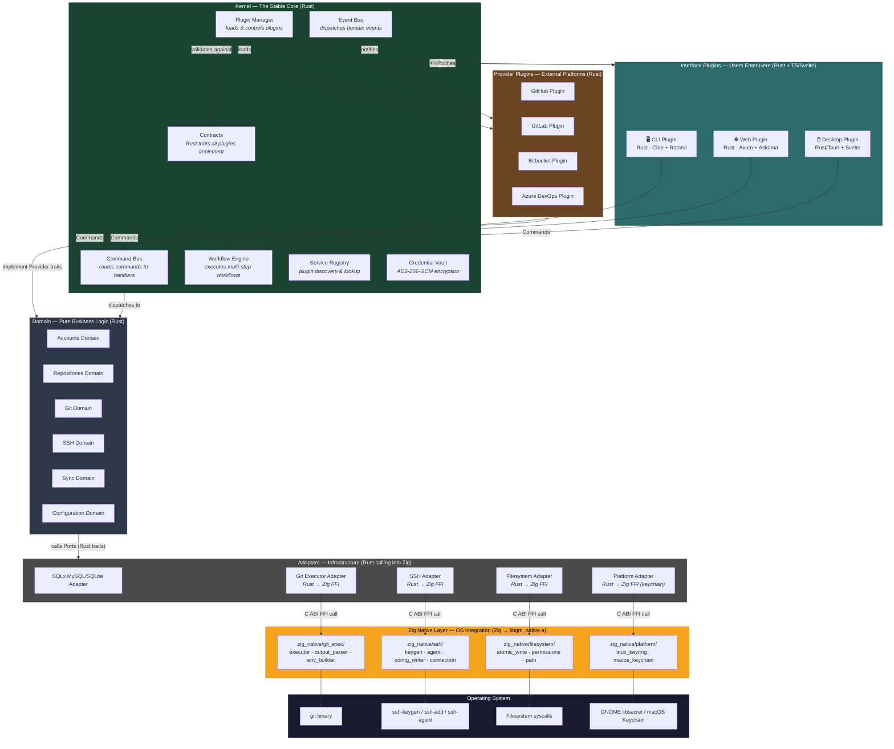

The cardinal rule of the hexagonal architecture still holds: dependency arrows only point inward. Interfaces know about the kernel. The kernel knows about the domain. The domain knows nothing outside itself — it declares Rust traits (ports) that adapters implement. The Zig layer is entirely invisible to the domain and the kernel; it is an implementation detail of the adapter layer.

---

## 3. Kernel Layer

The kernel is the heart of the application. It boots first, loads all plugins, wires up the communication channels, and then steps back. Written entirely in Rust, the kernel never touches Zig code. The Zig layer is only ever reached through adapter implementations that the kernel holds as opaque trait objects.

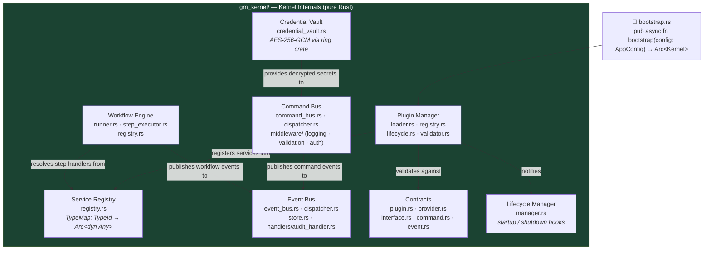

Understanding each kernel component is essential because the kernel is the only layer that knows about all other layers simultaneously — it is the wiring harness.

**`bootstrap.rs`** is the single async entry point that every launcher calls. It reads the application config, instantiates each kernel subsystem in order, reads the plugin registry from the database, loads plugins by priority, registers their services into the service registry, wires event subscriptions, and returns an `Arc<Kernel>` that every launcher holds. No business logic runs here — this is pure initialization.

**Plugin Manager** owns the full plugin lifecycle. In Rust, plugins can be loaded either statically (compiled into the binary as Rust crates) or dynamically (loaded from `.so` / `.dylib` files at runtime via `libloading`). The manager reads the `plugins` database table on boot, resolves dependency order using a topological sort, calls `on_load()` on each plugin while passing an `Arc<Kernel>` reference, and calls `on_unload()` in reverse order during shutdown. Dependency cycles cause a hard boot failure.

**Service Registry** is a type-indexed map (`DashMap<TypeId, Arc<dyn Any + Send + Sync>>`). When a plugin loads, it calls `kernel.register::<MyService>(Arc::new(MyServiceImpl {}))`. When another plugin or adapter needs that service, it calls `kernel.get::<MyService>()`. The type system ensures you cannot get a service of the wrong type — the compiler verifies it at the call site. This replaces a DI framework without requiring one.

**Command Bus** receives `Command` implementors from interface plugins and dispatches them to the correct async handler in the domain. It runs a middleware pipeline first: the logging middleware records every command's name and execution duration via `tracing`; the validation middleware calls `cmd.validate()` and returns an error to the caller before the domain ever sees the command; the auth middleware checks permissions if the command is tagged `#[requires_auth]`. The domain handler never sees an invalid or unauthorized command.

**Event Bus** is a typed publish-subscribe system. Domain services call `kernel.publish(RepositoryCloned { ... })` after completing an operation. The dispatcher looks up all handlers registered for that event type and calls them asynchronously. The audit handler (registered by the kernel itself, not by plugins) writes every event to the `events` and `audit_logs` database tables. Interface plugins register handlers that update their UI. The domain never knows any of this is happening.

**Workflow Engine** executes multi-step workflows defined in the `workflow_definitions` database table. A workflow like `clone_and_configure` has an ordered array of step definitions, each naming a handler function registered in the service registry. The engine loads the definition, creates a `WorkflowContext` (a JSON-serializable state bag), runs each step sequentially while passing the context forward, handles retries on failure, and rolls back completed steps if the `on_failure` policy is `rollback`. The workflow instance's current step and context are persisted to the database on every step transition so the system can resume after a crash.

**Credential Vault** uses the `ring` crate for AES-256-GCM encryption. On first run, it derives a machine-specific encryption key from the combination of the machine's `/etc/machine-id` and the user's home directory path using HKDF. This key never leaves memory and is never stored on disk. All secrets (PATs, OAuth tokens, SSH passphrases) are encrypted before being written to the database and decrypted on demand. On Linux, the vault can optionally delegate key storage to the GNOME libsecret backend through the Zig native layer's `linux_keyring.zig`.

---

## 4. Domain Layer

The domain contains all business logic and is written entirely in Rust. There is no Axum here. No SQLx here. No SSH libraries here. No Zig here. Only pure Rust structs and traits modeling real-world concepts. The Rust compiler enforces this: `gm_domain/Cargo.toml` does not list any infrastructure crates, so including them is a build error.

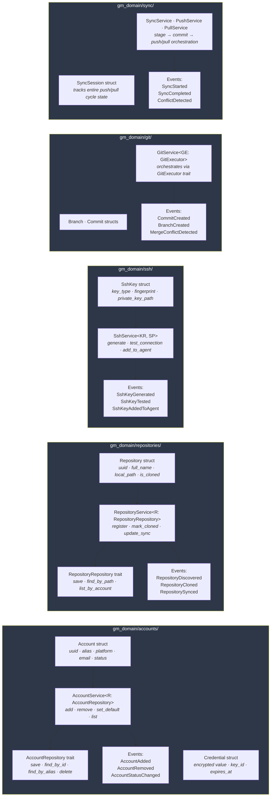

Each sub-domain is organized into three internal sublayers. **Entities** are Rust structs that enforce business invariants at construction time. For example, `Account::new()` returns `Result<Account, AccountError>` — it validates that the alias contains only lowercase letters, hyphens, and digits before the struct can exist. If validation fails, the `Account` struct never exists. You cannot have an invalid account in memory. **Services** are generic structs parameterized over their port traits: `AccountService<R: AccountRepository>` does not know whether R is a MySQL implementation or an in-memory test mock — that decision is made at the kernel bootstrap layer when the concrete type is wired in. **Ports** are Rust `trait` declarations marked with `#[async_trait]` so they can be used as `Box<dyn AccountRepository>` or `Arc<dyn AccountRepository>` trait objects.

Events are plain Rust structs implementing the `Event` trait, which requires `Serialize` and an `event_type() -> &'static str` method. They carry the minimum information needed by listeners — typically the UUID and a human-readable summary of what changed. They are value objects: immutable, owned by whoever creates them, and published through the event bus after a successful operation.

---

## 5. Ports — Inbound and Outbound

Ports are the formal hexagonal boundary. They are the only mechanism by which the inside of the system (domain, kernel) communicates with the outside (adapters, plugins, interfaces). All ports are Rust `trait` definitions.

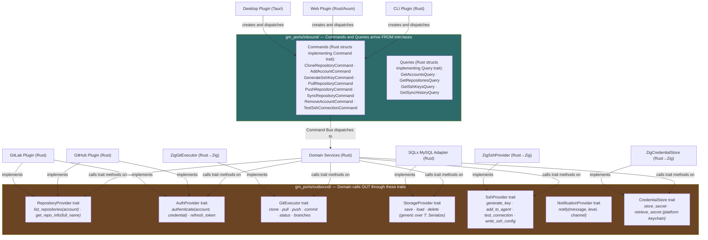

Notice the three Zig-backed adapters: `ZigGitExecutor`, `ZigSshProvider`, and `ZigCredentialStore`. The domain never knows these are backed by Zig. It only sees the Rust trait. The `impl GitExecutor for ZigGitExecutor` block in Rust calls into Zig through `unsafe { ffi::gm_git_clone(...) }`. The Zig function does the actual work and returns a result through a C-compatible struct. The Rust wrapper converts that C struct into a proper Rust `Result` type and returns it to the domain. The domain receives a clean, safe `Result<CloneResult, GitError>` with no awareness that Zig was involved.

---

## 6. Plugin Layer

Plugins are the ecosystem. Each plugin is a Rust crate that implements one or more kernel contracts. Provider plugins implement `RepositoryProvider` and `AuthProvider` for a specific Git hosting platform. Interface plugins implement `InterfacePlugin` and expose the application to users.

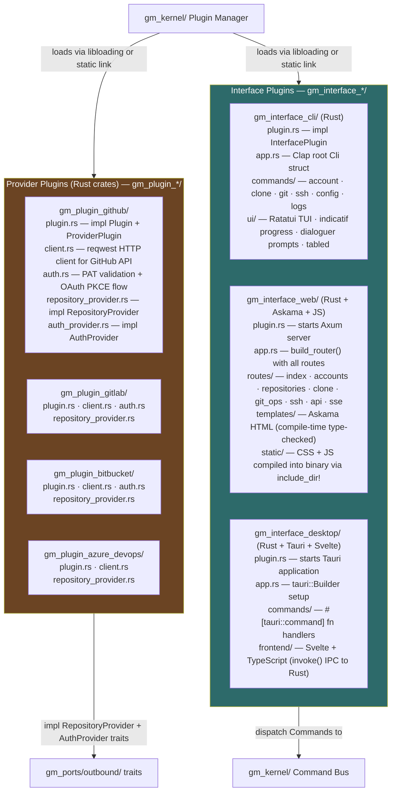

Every plugin follows the same structural contract enforced by the `Plugin` Rust trait: it has `name()`, `version()`, `plugin_type()`, `on_load(kernel: &Kernel)`, `on_unload()`, `get_services()` (returns `Vec<(TypeId, Arc<dyn Any>)>`), and `get_event_subscriptions()` (returns `Vec<EventSubscription>`). The kernel calls these through the trait object — it never knows the concrete type. This discipline prevents plugins from being "wild" — they can only interact with the rest of the system through declared channels.

---

## 7. Adapter Layer

Adapters are the concrete implementations of outbound ports. They are written in Rust and some of them delegate their actual OS work to the Zig native layer. Adapters have no business logic whatsoever — they translate between the domain's clean abstractions and the real world.

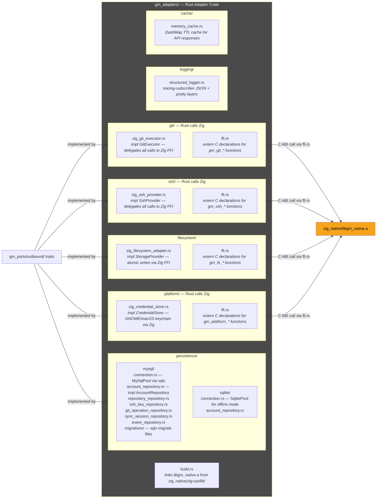

The `build.rs` file in `gm_adapters` is the bridge between the two languages. It instructs Cargo to link the Zig-compiled static library:

```rust
// gm_adapters/build.rs
fn main() {
    // First, build the Zig native layer
    let zig_out = std::env::var("CARGO_MANIFEST_DIR").unwrap();
    let zig_lib_path = format!("{}/../../../zig_native/zig-out/lib", zig_out);

    // Tell Cargo where to find libgm_native.a
    println!("cargo:rustc-link-search=native={}", zig_lib_path);
    println!("cargo:rustc-link-lib=static=gm_native");

    // System libraries the Zig code links against
    println!("cargo:rustc-link-lib=dylib=secret-1");  // GNOME libsecret (Linux)
    println!("cargo:rustc-link-lib=framework=Security"); // macOS Keychain (macOS)

    // Rebuild if Zig sources change
    println!("cargo:rerun-if-changed=../../../zig_native/src");
}
```

---

## 8. Zig Native Layer

This is the Zig layer — a standalone Zig library project that compiles to a C-compatible static archive. It contains no Rust and no business logic. Its entire purpose is to give the Rust adapters a precise, high-performance interface to OS-level operations that Zig handles more cleanly than Rust's unsafe FFI would.

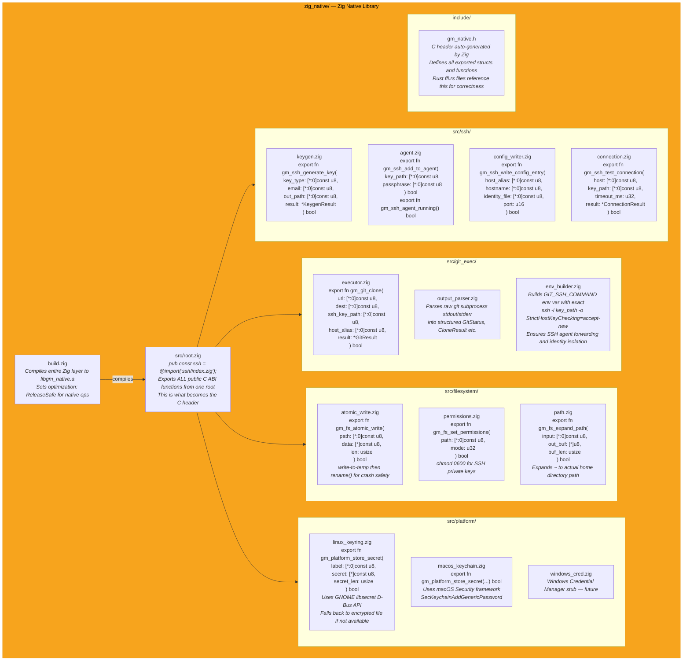

Understanding the Rust–Zig interop contract is critical because this is the boundary where two different languages meet. Zig can export functions with C calling conventions using `export fn`. These functions use only C-compatible types: pointers to null-terminated strings (`[*:0]const u8`), numeric types (`u32`, `bool`), and pointers to structs with `extern` layout. Zig's `extern struct` compiles to a C-compatible memory layout that Rust's `#[repr(C)]` struct mirrors exactly.

Here is the complete interop example for SSH key generation, showing both sides of the boundary:

```zig
// zig_native/src/ssh/keygen.zig

// The result struct uses extern layout so Rust can read it
pub const KeygenResult = extern struct {
    public_key: [4096]u8,       // null-terminated C string in fixed buffer
    public_key_len: usize,
    fingerprint: [256]u8,
    fingerprint_len: usize,
    error_message: [512]u8,
    error_len: usize,
};

// export keyword makes this a C ABI function — libloading can find it
pub export fn gm_ssh_generate_key(
    key_type: [*:0]const u8,    // "ed25519" or "rsa"
    email: [*:0]const u8,       // key comment
    out_path: [*:0]const u8,    // destination path for private key
    passphrase: [*:0]const u8,  // empty string means no passphrase
    result: *KeygenResult,       // caller-allocated output buffer
) bool {
    // Use Zig's std.ChildProcess to run ssh-keygen with exact args
    var child = std.process.Child.init(&.{
        "ssh-keygen", "-t", std.mem.span(key_type),
        "-C", std.mem.span(email),
        "-f", std.mem.span(out_path),
        "-N", std.mem.span(passphrase),
    }, std.heap.page_allocator);

    child.stdout_behavior = .Pipe;
    child.stderr_behavior = .Pipe;

    child.spawn() catch |err| {
        writeError(result, @errorName(err));
        return false;
    };

    // Parse the public key file and fingerprint from output
    // ... Zig handles all the string parsing and buffer filling
    return true;
}
```

```rust
// gm_adapters/src/ssh/ffi.rs

use std::os::raw::c_char;

/// Mirror of Zig's KeygenResult extern struct.
/// #[repr(C)] guarantees identical memory layout to Zig's extern struct.
#[repr(C)]
pub struct KeygenResult {
    pub public_key: [u8; 4096],
    pub public_key_len: usize,
    pub fingerprint: [u8; 256],
    pub fingerprint_len: usize,
    pub error_message: [u8; 512],
    pub error_len: usize,
}

impl KeygenResult {
    pub fn zeroed() -> Self {
        // SAFETY: KeygenResult contains only integer types; all-zero is valid.
        unsafe { std::mem::zeroed() }
    }

    pub fn public_key_str(&self) -> &str {
        let slice = &self.public_key[..self.public_key_len];
        std::str::from_utf8(slice).unwrap_or("")
    }
}

// extern "C" block declares the Zig-exported functions to Rust.
// The linker resolves these against libgm_native.a at link time.
extern "C" {
    pub fn gm_ssh_generate_key(
        key_type: *const c_char,
        email: *const c_char,
        out_path: *const c_char,
        passphrase: *const c_char,
        result: *mut KeygenResult,
    ) -> bool;

    pub fn gm_ssh_add_to_agent(
        key_path: *const c_char,
        passphrase: *const c_char,
    ) -> bool;

    pub fn gm_ssh_test_connection(
        host: *const c_char,
        key_path: *const c_char,
        timeout_ms: u32,
        result: *mut ConnectionResult,
    ) -> bool;

    pub fn gm_ssh_write_config_entry(
        host_alias: *const c_char,
        hostname: *const c_char,
        identity_file: *const c_char,
        port: u16,
    ) -> bool;
}
```

```rust
// gm_adapters/src/ssh/zig_ssh_provider.rs

use std::ffi::CString;
use crate::ssh::ffi::{self, KeygenResult, ConnectionResult};
use gm_ports::outbound::ssh_provider::{SshProvider, KeygenOptions, SshKeyResult, ConnectionResult as DomainConnectionResult};

pub struct ZigSshProvider;

#[async_trait::async_trait]
impl SshProvider for ZigSshProvider {
    async fn generate_key(&self, opts: KeygenOptions) -> Result<SshKeyResult, gm_shared::errors::SshError> {
        // Convert Rust Strings to C-compatible null-terminated strings
        let key_type = CString::new(opts.key_type.as_str()).unwrap();
        let email = CString::new(opts.email.as_str()).unwrap();
        let out_path = CString::new(opts.output_path.to_str().unwrap()).unwrap();
        let passphrase = CString::new(opts.passphrase.unwrap_or_default()).unwrap();

        let mut result = KeygenResult::zeroed();

        // Call into Zig through the C ABI boundary
        // unsafe is required because we are calling across the FFI boundary.
        // The safety contract: result is a valid pointer to a zeroed KeygenResult,
        // all CStrings are valid and non-null, and Zig owns no memory we need to free.
        let success = unsafe {
            ffi::gm_ssh_generate_key(
                key_type.as_ptr(),
                email.as_ptr(),
                out_path.as_ptr(),
                passphrase.as_ptr(),
                &mut result,
            )
        };

        if success {
            Ok(SshKeyResult {
                public_key: result.public_key_str().to_owned(),
                fingerprint: result.fingerprint_str().to_owned(),
                private_key_path: opts.output_path,
            })
        } else {
            Err(gm_shared::errors::SshError::KeyGenerationFailed {
                reason: result.error_message_str().to_owned(),
            })
        }
    }
}
```

This pattern repeats for every Zig-backed adapter: `ZigGitExecutor`, `ZigFilesystemAdapter`, and `ZigCredentialStore` each have their own `ffi.rs` with `extern "C"` declarations and a `zig_*.rs` file that wraps the unsafe FFI calls in a safe Rust `impl` block.

---

## 9. Shared Layer

The shared layer contains types, errors, constants, validation, and utilities that are used across all Rust crates. Nothing in `gm_shared` imports from `gm_domain`, `gm_kernel`, `gm_adapters`, `gm_ports`, or any plugin. It depends only on `serde`, `uuid`, `chrono`, and `thiserror`.

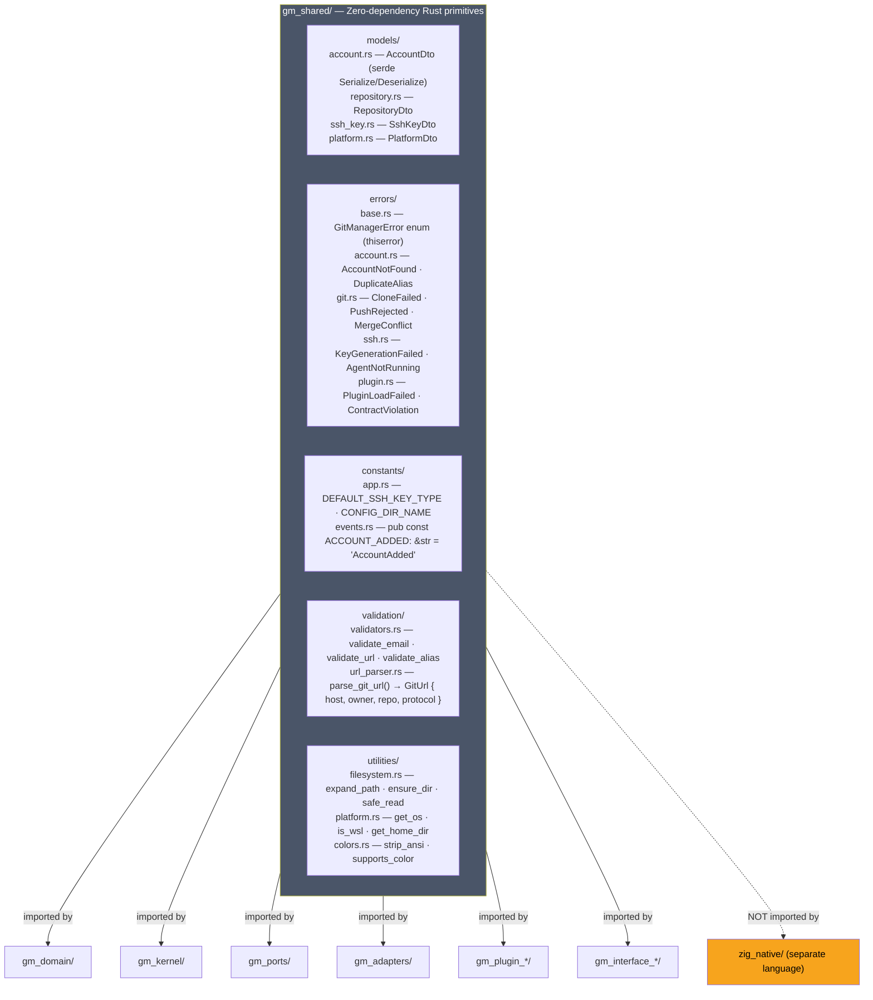

Note that `gm_shared` has no connection to the Zig native layer. The Zig layer is a completely separate build system with its own types. The translation between Zig's C ABI types and Rust's `gm_shared` types happens inside the `gm_adapters` crate, in the `zig_*.rs` files that call FFI and then convert results into `gm_shared` types before returning to the domain.

---

## 10. Complete Folder Structure

Every folder and file in the project, with its reason for existing. The project root contains both a Cargo workspace (Rust) and a Zig project — these are two independent build systems that cooperate through the `build.rs` linker script in `gm_adapters`.

```
git_manager/                              ← Project root: both Rust workspace + Zig project
│
├── Cargo.toml                            ← Rust workspace manifest
│                                             [workspace] members = ["crates/*", "apps/*"]
│                                             [workspace.dependencies] shared version pinning
│
├── Cargo.lock                            ← Always committed for binary projects
│
├── build.zig                             ← Top-level Zig build: builds zig_native/ as step
│                                             Used when you want one command to build everything:
│                                             `zig build && cargo build --release`
│
├── build.zig.zon                         ← Zig package manifest: Zig stdlib version pin
│
├── rust-toolchain.toml                   ← Pins Rust edition to stable channel
│
├── .cargo/config.toml                    ← Cargo settings: target-dir, cross-compile targets
│
├── clippy.toml                           ← Clippy lint configuration (pedantic level)
│
├── deny.toml                             ← cargo-deny: license whitelist + vuln audit
│
├── .github/workflows/
│   ├── ci.yml                            ← Runs: zig build test + cargo test + cargo clippy
│   └── release.yml                       ← Cross-compiles all targets, uploads release artifacts
│
│ ═══════════════════════════════════════
│  ZIG NATIVE LAYER — Standalone Zig project
│  Produces: zig_native/zig-out/lib/libgm_native.a
│  Rust links this via gm_adapters/build.rs
│ ═══════════════════════════════════════
│
├── zig_native/
│   ├── build.zig                         ← Zig build script
│   │                                         const lib = b.addStaticLibrary(.{
│   │                                             .name = "gm_native",
│   │                                             .root_source_file = .{ .path = "src/root.zig" },
│   │                                             .optimize = .ReleaseSafe,
│   │                                         });
│   │                                         lib.linkSystemLibrary("secret-1");  // Linux: GNOME libsecret
│   │                                         lib.addIncludePath(.{ .path = "include" });
│   │                                         b.installArtifact(lib);
│   │
│   ├── build.zig.zon                     ← Zig package dependencies
│   │
│   ├── src/
│   │   ├── root.zig                      ← Library root: imports and re-exports all modules
│   │   │                                     pub const ssh = @import("ssh/index.zig");
│   │   │                                     pub const git_exec = @import("git_exec/index.zig");
│   │   │                                     pub const filesystem = @import("filesystem/index.zig");
│   │   │                                     pub const platform = @import("platform/index.zig");
│   │   │
│   │   ├── ssh/
│   │   │   ├── index.zig                 ← SSH module root: re-exports all C ABI functions
│   │   │   ├── keygen.zig                ← export fn gm_ssh_generate_key(...) bool
│   │   │   │                                 Spawns ssh-keygen with precise args
│   │   │   │                                 Reads public key file, extracts fingerprint
│   │   │   │                                 Fills KeygenResult buffer, returns bool success
│   │   │   ├── agent.zig                 ← export fn gm_ssh_add_to_agent(...) bool
│   │   │   │                                 export fn gm_ssh_agent_running() bool
│   │   │   │                                 Checks SSH_AUTH_SOCK, runs ssh-add
│   │   │   ├── config_writer.zig         ← export fn gm_ssh_write_config_entry(...) bool
│   │   │   │                                 Reads ~/.ssh/config, checks for existing host alias
│   │   │   │                                 Appends new Host block atomically
│   │   │   └── connection.zig            ← export fn gm_ssh_test_connection(...) bool
│   │   │                                     Runs: ssh -T -i key_path -o StrictHostKeyChecking=accept-new host
│   │   │                                     Parses "Hi username! You've authenticated" from stdout
│   │   │                                     Enforces timeout_ms using SIGALRM
│   │   │
│   │   ├── git_exec/
│   │   │   ├── index.zig                 ← Git execution module root
│   │   │   ├── executor.zig              ← export fn gm_git_clone(...) bool
│   │   │   │                                 export fn gm_git_pull(...) bool
│   │   │   │                                 export fn gm_git_push(...) bool
│   │   │   │                                 export fn gm_git_commit(...) bool
│   │   │   │                                 export fn gm_git_status(...) bool
│   │   │   │                                 Uses std.ChildProcess with env from env_builder.zig
│   │   │   │                                 Captures stdout + stderr into result buffers
│   │   │   ├── output_parser.zig         ← Parses raw git output into structured data
│   │   │   │                                 parse_clone_progress(line) → CloneProgress
│   │   │   │                                 parse_status_porcelain(output) → GitStatus
│   │   │   │                                 parse_push_result(output) → PushResult
│   │   │   └── env_builder.zig           ← build_git_env(ssh_key_path, host_alias) → Env
│   │   │                                     Constructs GIT_SSH_COMMAND:
│   │   │                                     "ssh -i {key_path} -o StrictHostKeyChecking=accept-new
│   │   │                                      -o IdentitiesOnly=yes"
│   │   │                                     Ensures the right SSH key is always used
│   │   │
│   │   ├── filesystem/
│   │   │   ├── index.zig
│   │   │   ├── atomic_write.zig          ← export fn gm_fs_atomic_write(...) bool
│   │   │   │                                 Writes to .tmp file then rename() to destination
│   │   │   │                                 rename() is atomic on POSIX — prevents corrupt config files
│   │   │   │                                 on crash midway through write
│   │   │   ├── permissions.zig           ← export fn gm_fs_set_permissions(path, mode: u32) bool
│   │   │   │                                 Calls chmod(path, mode) via std.posix
│   │   │   │                                 Used to set 0600 on SSH private key files (required by SSH)
│   │   │   └── path.zig                  ← export fn gm_fs_expand_path(input, out_buf, buf_len) bool
│   │   │                                     Expands ~ to home directory
│   │   │                                     Resolves symlinks via realpath()
│   │   │                                     Returns absolute canonical path in caller-provided buffer
│   │   │
│   │   └── platform/
│   │       ├── index.zig                 ← Platform module: comptime-selects correct backend
│   │       │                                 const keyring = if (builtin.os.tag == .linux)
│   │       │                                     @import("linux_keyring.zig")
│   │       │                                 else if (builtin.os.tag == .macos)
│   │       │                                     @import("macos_keychain.zig")
│   │       │                                 else @import("fallback_keyring.zig");
│   │       │                                 pub const gm_platform_store_secret = keyring.store_secret;
│   │       │                                 pub const gm_platform_retrieve_secret = keyring.retrieve_secret;
│   │       ├── linux_keyring.zig         ← GNOME libsecret integration
│   │       │                                 Links against libsecret-1 via libsecret C headers
│   │       │                                 secret_password_store_sync() for storing
│   │       │                                 secret_password_lookup_sync() for retrieving
│   │       │                                 Falls back to encrypted file if D-Bus unavailable
│   │       ├── macos_keychain.zig        ← macOS Security framework integration
│   │       │                                 SecKeychainAddGenericPassword() for storing
│   │       │                                 SecKeychainFindGenericPassword() for retrieving
│   │       │                                 Removes the need for Rust unsafe blocks around ObjC
│   │       ├── fallback_keyring.zig      ← Encrypted file fallback (any OS without a keychain)
│   │       │                                 Stores secrets in ~/.git-manager/secrets.enc
│   │       │                                 AES-256-GCM via Zig's std.crypto
│   │       └── windows_cred.zig          ← Windows Credential Manager stub for future support
│   │
│   └── include/
│       └── gm_native.h                   ← C header defining all exported types and functions
│                                             Generated by: zig build emit-h
│                                             Used as reference when writing Rust ffi.rs files
│                                             Ensures type agreement between Zig and Rust sides
│
│ ═══════════════════════════════════════
│  RUST CRATES — The Cargo Workspace
│ ═══════════════════════════════════════
│
├── crates/
│   │
│   ├── gm_shared/                        ← SHARED LAYER — zero-dependency Rust primitives
│   │   ├── Cargo.toml                    ← [dependencies]: serde, uuid, chrono, thiserror
│   │   └── src/
│   │       ├── lib.rs
│   │       ├── models/
│   │       │   ├── mod.rs
│   │       │   ├── account.rs            ← AccountDto: #[derive(Debug, Clone, Serialize, Deserialize)]
│   │       │   ├── repository.rs         ← RepositoryDto
│   │       │   ├── ssh_key.rs            ← SshKeyDto
│   │       │   └── platform.rs           ← PlatformDto
│   │       ├── errors/
│   │       │   ├── mod.rs
│   │       │   ├── base.rs               ← #[derive(thiserror::Error)] pub enum GitManagerError
│   │       │   ├── account.rs            ← AccountError: AccountNotFound · DuplicateAlias · AccountSuspended
│   │       │   ├── git.rs                ← GitError: CloneFailed · PushRejected · MergeConflict
│   │       │   ├── ssh.rs                ← SshError: KeyGenerationFailed · AgentNotRunning
│   │       │   └── plugin.rs             ← PluginError: LoadFailed · ContractViolation · DependencyMissing
│   │       ├── constants/
│   │       │   ├── mod.rs
│   │       │   ├── app.rs                ← DEFAULT_SSH_KEY_TYPE, CONFIG_DIR_NAME, DEFAULT_BRANCH
│   │       │   └── events.rs             ← pub const ACCOUNT_ADDED: &str = "AccountAdded"; (typo prevention)
│   │       ├── validation/
│   │       │   ├── mod.rs
│   │       │   ├── validators.rs         ← validate_email(), validate_url(), validate_alias()
│   │       │   └── url_parser.rs         ← parse_git_url() → GitUrl { host, owner, repo, protocol }
│   │       └── utilities/
│   │           ├── mod.rs
│   │           ├── filesystem.rs         ← expand_path(), ensure_dir(), safe_read(), safe_write()
│   │           ├── platform.rs           ← get_os(), is_wsl(), get_home_dir()
│   │           └── colors.rs             ← strip_ansi(), supports_color()
│   │
│   ├── gm_domain/                        ← DOMAIN LAYER — pure Rust business logic, zero I/O
│   │   ├── Cargo.toml                    ← [dependencies]: gm_shared, serde, uuid, chrono, async-trait
│   │   └── src/
│   │       ├── lib.rs
│   │       ├── accounts/
│   │       │   ├── mod.rs
│   │       │   ├── entities/
│   │       │   │   ├── mod.rs
│   │       │   │   ├── account.rs        ← pub struct Account { ... }
│   │       │   │   │                         impl Account { pub fn new(...) → Result<Self, AccountError> }
│   │       │   │   │                         Business rules enforced at construction time
│   │       │   │   └── credential.rs     ← pub struct Credential { uuid, account_id, cred_type, encrypted_value }
│   │       │   ├── value_objects/
│   │       │   │   ├── mod.rs
│   │       │   │   ├── platform_type.rs  ← pub enum PlatformType { GitHub, GitLab, Bitbucket, AzureDevOps, Custom }
│   │       │   │   ├── account_status.rs ← pub enum AccountStatus { Active, Inactive, Suspended, TokenExpired }
│   │       │   │   └── auth_method.rs    ← pub enum AuthMethod { Ssh, HttpsPat, HttpsPassword, OAuth }
│   │       │   ├── ports/
│   │       │   │   ├── mod.rs
│   │       │   │   └── account_repository.rs  ← #[async_trait] pub trait AccountRepository: Send + Sync { ... }
│   │       │   ├── services/
│   │       │   │   ├── mod.rs
│   │       │   │   └── account_service.rs     ← pub struct AccountService<R: AccountRepository>
│   │       │   └── events/
│   │       │       ├── mod.rs
│   │       │       ├── account_added.rs
│   │       │       ├── account_removed.rs
│   │       │       └── account_status_changed.rs
│   │       ├── repositories/
│   │       │   ├── mod.rs
│   │       │   ├── entities/
│   │       │   │   ├── mod.rs
│   │       │   │   └── repository.rs     ← pub struct Repository { is_cloned, local_path: Option<PathBuf>, ... }
│   │       │   ├── value_objects/
│   │       │   │   ├── mod.rs
│   │       │   │   ├── repository_url.rs ← pub struct RepositoryUrl(String); validated at construction
│   │       │   │   └── clone_status.rs   ← pub enum CloneStatus { NotCloned, Cloning, Cloned, Failed(String) }
│   │       │   ├── ports/
│   │       │   │   ├── mod.rs
│   │       │   │   └── repository_repository.rs
│   │       │   ├── services/
│   │       │   │   ├── mod.rs
│   │       │   │   └── repository_service.rs
│   │       │   └── events/
│   │       │       ├── mod.rs
│   │       │       ├── repository_discovered.rs
│   │       │       ├── repository_cloned.rs
│   │       │       └── repository_synced.rs
│   │       ├── ssh/
│   │       │   ├── mod.rs
│   │       │   ├── entities/
│   │       │   │   ├── mod.rs
│   │       │   │   ├── ssh_key.rs
│   │       │   │   └── ssh_host_config.rs
│   │       │   ├── value_objects/
│   │       │   │   ├── mod.rs
│   │       │   │   ├── key_type.rs       ← pub enum KeyType { Ed25519, Rsa(u32), Ecdsa }
│   │       │   │   └── test_status.rs    ← pub enum TestStatus { Success, Failed(String), Untested }
│   │       │   ├── ports/
│   │       │   │   ├── mod.rs
│   │       │   │   ├── ssh_key_repository.rs
│   │       │   │   └── ssh_host_config_repository.rs
│   │       │   ├── services/
│   │       │   │   ├── mod.rs
│   │       │   │   └── ssh_service.rs    ← generate_key · test_connection · add_to_agent · write_ssh_config
│   │       │   └── events/
│   │       │       ├── mod.rs
│   │       │       ├── ssh_key_generated.rs
│   │       │       ├── ssh_key_tested.rs
│   │       │       └── ssh_key_added_to_agent.rs
│   │       ├── git/
│   │       │   ├── mod.rs
│   │       │   ├── entities/
│   │       │   │   ├── mod.rs
│   │       │   │   ├── branch.rs
│   │       │   │   └── commit.rs
│   │       │   ├── ports/
│   │       │   │   ├── mod.rs
│   │       │   │   └── git_executor.rs   ← #[async_trait] pub trait GitExecutor: Send + Sync { clone · pull · push · commit · status }
│   │       │   ├── services/
│   │       │   │   ├── mod.rs
│   │       │   │   ├── git_service.rs
│   │       │   │   └── conflict_resolver.rs
│   │       │   └── events/
│   │       │       ├── mod.rs
│   │       │       ├── commit_created.rs
│   │       │       ├── branch_created.rs
│   │       │       └── merge_conflict_detected.rs
│   │       ├── sync/
│   │       │   ├── mod.rs
│   │       │   ├── entities/
│   │       │   │   ├── mod.rs
│   │       │   │   └── sync_session.rs
│   │       │   ├── ports/
│   │       │   │   ├── mod.rs
│   │       │   │   └── sync_session_repository.rs
│   │       │   ├── services/
│   │       │   │   ├── mod.rs
│   │       │   │   ├── sync_service.rs
│   │       │   │   ├── push_service.rs
│   │       │   │   └── pull_service.rs
│   │       │   └── events/
│   │       │       ├── mod.rs
│   │       │       ├── sync_started.rs
│   │       │       ├── sync_completed.rs
│   │       │       └── conflict_detected.rs
│   │       └── configuration/
│   │           ├── mod.rs
│   │           ├── entities/
│   │           │   ├── mod.rs
│   │           │   └── configuration.rs
│   │           ├── ports/
│   │           │   ├── mod.rs
│   │           │   └── config_repository.rs
│   │           └── services/
│   │               ├── mod.rs
│   │               └── config_service.rs
│   │
│   ├── gm_ports/                         ← PORTS LAYER — hexagonal boundary definitions
│   │   ├── Cargo.toml                    ← [dependencies]: gm_shared, gm_domain, async-trait, serde
│   │   └── src/
│   │       ├── lib.rs
│   │       ├── inbound/
│   │       │   ├── mod.rs
│   │       │   ├── commands/
│   │       │   │   ├── mod.rs
│   │       │   │   ├── clone_repository.rs   ← CloneRepositoryCommand { url, account_alias, dest_path }
│   │       │   │   ├── add_account.rs
│   │       │   │   ├── remove_account.rs
│   │       │   │   ├── generate_ssh_key.rs
│   │       │   │   ├── test_ssh_connection.rs
│   │       │   │   ├── pull_repository.rs
│   │       │   │   ├── push_repository.rs
│   │       │   │   └── sync_repository.rs
│   │       │   └── queries/
│   │       │       ├── mod.rs
│   │       │       ├── get_accounts.rs
│   │       │       ├── get_repositories.rs
│   │       │       ├── get_ssh_keys.rs
│   │       │       └── get_sync_history.rs
│   │       └── outbound/
│   │           ├── mod.rs
│   │           ├── repository_provider.rs   ← pub trait RepositoryProvider: Send + Sync
│   │           ├── auth_provider.rs          ← pub trait AuthProvider: Send + Sync
│   │           ├── git_executor.rs           ← pub trait GitExecutor: Send + Sync
│   │           ├── storage_provider.rs       ← pub trait StorageProvider: Send + Sync
│   │           ├── ssh_provider.rs           ← pub trait SshProvider: Send + Sync
│   │           ├── credential_store.rs       ← pub trait CredentialStore: Send + Sync (OS keychain)
│   │           └── notification_provider.rs  ← pub trait NotificationProvider: Send + Sync
│   │
│   ├── gm_kernel/                        ← KERNEL LAYER — microkernel runtime (pure Rust)
│   │   ├── Cargo.toml                    ← [dependencies]: gm_shared, gm_domain, gm_ports,
│   │   │                                     tokio (full), dashmap, anymap2, tracing, ring, libloading
│   │   └── src/
│   │       ├── lib.rs
│   │       ├── bootstrap.rs              ← pub async fn bootstrap(config: AppConfig) → Result<Arc<Kernel>>
│   │       ├── kernel.rs                 ← pub struct Kernel { all subsystems }
│   │       │                                 pub async fn dispatch<C: Command>(&self, cmd: C) → CommandResult
│   │       │                                 pub async fn publish<E: Event>(&self, event: E)
│   │       │                                 pub fn get<T: Any + Send + Sync>(&self) → Option<Arc<T>>
│   │       ├── plugin_system/
│   │       │   ├── mod.rs
│   │       │   ├── loader.rs             ← loads .so via libloading: calls create_plugin() ABI entry
│   │       │   ├── registry.rs           ← DashMap<String, Arc<dyn Plugin>>
│   │       │   ├── validator.rs          ← validates plugin version compat and dependency graph
│   │       │   └── lifecycle.rs          ← calls on_load() in priority order, on_unload() in reverse
│   │       ├── event_bus/
│   │       │   ├── mod.rs
│   │       │   ├── event_bus.rs          ← pub async fn publish<E: Event + Serialize>(&self, event: E)
│   │       │   ├── dispatcher.rs         ← DashMap<String, Vec<Arc<dyn ErasedHandler>>>
│   │       │   ├── store.rs              ← pub trait EventStore: Send + Sync { append() }
│   │       │   └── handlers/
│   │       │       ├── mod.rs
│   │       │       └── audit_handler.rs  ← writes every event to audit_logs table in DB
│   │       ├── command_bus/
│   │       │   ├── mod.rs
│   │       │   ├── command_bus.rs        ← dispatch<C: Command>() runs middleware then handler
│   │       │   ├── dispatcher.rs         ← TypeMap: TypeId → Box<dyn ErasedHandler>
│   │       │   └── middleware/
│   │       │       ├── mod.rs            ← pub trait Middleware: Send + Sync { async fn handle(cmd, next) }
│   │       │       ├── logging.rs        ← tracing::info!("command {:?} completed in {:?}", name, duration)
│   │       │       ├── validation.rs     ← calls cmd.validate() before dispatch
│   │       │       └── auth.rs           ← checks permission for commands marked requires_auth
│   │       ├── workflow_engine/
│   │       │   ├── mod.rs
│   │       │   ├── runner.rs             ← WorkflowRunner: load definition → run steps → handle retry
│   │       │   ├── step_executor.rs      ← resolves step handler from ServiceRegistry → execute → pass context
│   │       │   └── registry.rs           ← HashMap<String, WorkflowDefinition>
│   │       ├── service_registry/
│   │       │   ├── mod.rs
│   │       │   └── registry.rs           ← DashMap<TypeId, Arc<dyn Any + Send + Sync>>
│   │       ├── lifecycle/
│   │       │   ├── mod.rs
│   │       │   └── manager.rs            ← LifecycleManager: on_startup() + on_shutdown() chains
│   │       ├── security/
│   │       │   ├── mod.rs
│   │       │   ├── permission_checker.rs ← stub returning true for v1 (single-user local tool)
│   │       │   └── credential_vault.rs   ← AES-256-GCM via ring: encrypt() + decrypt() + derive_key()
│   │       └── contracts/
│   │           ├── mod.rs
│   │           ├── plugin.rs             ← pub trait Plugin: Send + Sync { on_load · on_unload · get_services · ... }
│   │           ├── provider.rs           ← pub trait ProviderPlugin: Plugin
│   │           ├── interface.rs          ← pub trait InterfacePlugin: Plugin { async fn run(&self) }
│   │           ├── command.rs            ← pub trait Command: Send + Sync { type Output; fn validate() }
│   │           └── event.rs              ← pub trait Event: Send + Sync + Serialize { fn event_type() → &'static str }
│   │
│   ├── gm_adapters/                      ← ADAPTER LAYER — Rust implementations that call Zig
│   │   ├── Cargo.toml                    ← [dependencies]: gm_domain, gm_ports, gm_shared,
│   │   │                                     sqlx (mysql + runtime-tokio), tokio, tracing, dashmap, serde_json
│   │   ├── build.rs                      ← Links libgm_native.a from zig_native/zig-out/lib/
│   │   │                                     println!("cargo:rustc-link-lib=static=gm_native");
│   │   │                                     Triggers zig build before cargo build in CI
│   │   └── src/
│   │       ├── lib.rs
│   │       ├── persistence/
│   │       │   ├── mod.rs
│   │       │   ├── mysql/
│   │       │   │   ├── mod.rs
│   │       │   │   ├── connection.rs          ← MySqlPool via sqlx::MySqlPoolOptions
│   │       │   │   ├── account_repository.rs  ← impl AccountRepository for MySqlAccountRepository
│   │       │   │   ├── repository_repository.rs
│   │       │   │   ├── ssh_key_repository.rs
│   │       │   │   ├── git_operation_repository.rs
│   │       │   │   ├── sync_session_repository.rs
│   │       │   │   └── event_repository.rs
│   │       │   ├── sqlite/
│   │       │   │   ├── mod.rs
│   │       │   │   └── account_repository.rs  ← impl AccountRepository for SqliteAccountRepository
│   │       │   └── migrations/
│   │       │       ├── 20240101000000_initial_schema.sql
│   │       │       └── 20240101000001_seed_platforms.sql
│   │       ├── git/
│   │       │   ├── mod.rs
│   │       │   ├── zig_git_executor.rs        ← pub struct ZigGitExecutor;
│   │       │   │                                  impl GitExecutor for ZigGitExecutor {
│   │       │   │                                      async fn clone(...) { unsafe { ffi::gm_git_clone(...) } }
│   │       │   │                                  }
│   │       │   └── ffi.rs                     ← extern "C" { fn gm_git_clone(...) → bool; ... }
│   │       │                                      #[repr(C)] pub struct GitResult { ... }
│   │       ├── ssh/
│   │       │   ├── mod.rs
│   │       │   ├── zig_ssh_provider.rs        ← impl SshProvider for ZigSshProvider
│   │       │   │                                  Converts Rust types → CString → calls Zig FFI
│   │       │   │                                  Converts Zig result buffers → Rust Result types
│   │       │   └── ffi.rs                     ← extern "C" { fn gm_ssh_generate_key(...); ... }
│   │       │                                      #[repr(C)] pub struct KeygenResult { ... }
│   │       ├── filesystem/
│   │       │   ├── mod.rs
│   │       │   ├── zig_filesystem_adapter.rs  ← impl StorageProvider for ZigFilesystemAdapter
│   │       │   │                                  Calls gm_fs_atomic_write for crash-safe config writes
│   │       │   └── ffi.rs                     ← extern "C" { fn gm_fs_atomic_write(...); fn gm_fs_set_permissions(...); }
│   │       ├── platform/
│   │       │   ├── mod.rs
│   │       │   ├── zig_credential_store.rs    ← impl CredentialStore for ZigCredentialStore
│   │       │   │                                  On Linux: delegates to GNOME libsecret via Zig
│   │       │   │                                  On macOS: delegates to Keychain via Zig
│   │       │   │                                  On others: uses encrypted file via Zig fallback
│   │       │   └── ffi.rs                     ← extern "C" { fn gm_platform_store_secret(...); fn gm_platform_retrieve_secret(...); }
│   │       ├── logging/
│   │       │   ├── mod.rs
│   │       │   └── structured_logger.rs       ← tracing-subscriber: JsonLayer → file + PrettyLayer → stderr
│   │       └── cache/
│   │           ├── mod.rs
│   │           └── memory_cache.rs            ← DashMap TTL cache for API response warm-up
│   │
│   ├── gm_plugin_github/
│   │   ├── Cargo.toml                         ← [dependencies]: gm_ports, gm_shared, reqwest, async-trait, serde
│   │   └── src/
│   │       ├── lib.rs                         ← #[no_mangle] pub extern "C" fn create_plugin() → *mut dyn Plugin
│   │       ├── plugin.rs                      ← GitHubPlugin: impl Plugin + ProviderPlugin
│   │       ├── client.rs                      ← GitHub REST API v3 client using reqwest
│   │       ├── auth.rs                        ← PAT validation · OAuth PKCE flow · token refresh
│   │       ├── repository_provider.rs         ← impl RepositoryProvider for GitHubRepositoryProvider
│   │       └── auth_provider.rs               ← impl AuthProvider for GitHubAuthProvider
│   │
│   ├── gm_plugin_gitlab/
│   │   └── src/ (plugin.rs · client.rs · auth.rs · repository_provider.rs)
│   │
│   ├── gm_plugin_bitbucket/
│   │   └── src/ (plugin.rs · client.rs · auth.rs · repository_provider.rs)
│   │
│   ├── gm_plugin_azure_devops/
│   │   └── src/ (plugin.rs · client.rs · repository_provider.rs)
│   │
│   ├── gm_interface_cli/
│   │   ├── Cargo.toml                         ← [dependencies]: gm_kernel, gm_ports, gm_shared,
│   │   │                                           clap (derive), ratatui, crossterm, indicatif, dialoguer, tabled, owo-colors, tokio
│   │   └── src/
│   │       ├── lib.rs
│   │       ├── plugin.rs                      ← CliPlugin: impl InterfacePlugin
│   │       ├── app.rs                         ← #[derive(Parser)] pub struct Cli { #[command(subcommand)] Commands }
│   │       ├── commands/
│   │       │   ├── mod.rs
│   │       │   ├── account.rs                 ← AccountCmd { Add, List, Remove, Test, SetDefault }
│   │       │   │                                  Each variant creates a Command struct → kernel.dispatch()
│   │       │   ├── clone.rs                   ← CloneCmd: parse URL → CloneRepositoryCommand → dispatch
│   │       │   ├── git.rs                     ← GitCmd { Pull, Push, Sync, Status }
│   │       │   ├── ssh.rs                     ← SshCmd { Generate, Test, List, AddToAgent }
│   │       │   ├── config.rs                  ← ConfigCmd { Get, Set, Reset, List }
│   │       │   └── logs.rs                    ← LogsCmd { tail N, filter type=clone, export }
│   │       └── ui/
│   │           ├── mod.rs
│   │           ├── colors.rs                  ← owo-colors constants for the project color theme
│   │           ├── theme.rs                   ← DarkTheme: applies constants to all CLI output
│   │           ├── tables.rs                  ← tabled crate: AccountTable · RepositoryTable · SshKeyTable
│   │           ├── progress.rs                ← indicatif ProgressBar: CloneProgress · SyncProgress
│   │           ├── prompts.rs                 ← dialoguer: select_platform · prompt_email · confirm_destructive
│   │           └── interactive.rs             ← ratatui full TUI: stateful menu · account list · repo browser
│   │
│   ├── gm_interface_web/
│   │   ├── Cargo.toml                         ← [dependencies]: gm_kernel, gm_ports, gm_shared,
│   │   │                                           axum (full), tokio (full), tower, tower-http,
│   │   │                                           askama, serde_json, tokio-stream, include_dir
│   │   └── src/
│   │       ├── lib.rs
│   │       ├── plugin.rs                      ← WebPlugin: impl InterfacePlugin, starts Axum
│   │       ├── app.rs                         ← build_router(Arc<Kernel>) → Router with all routes
│   │       ├── state.rs                       ← pub struct AppState { kernel: Arc<Kernel> }
│   │       ├── session.rs                     ← Cookie-based session token for optional local auth
│   │       │                                      First run: generates random 32-byte token in ~/.git-manager/web_token
│   │       │                                      Sets HttpOnly, SameSite=Strict cookie
│   │       ├── routes/
│   │       │   ├── mod.rs
│   │       │   ├── index.rs                   ← GET / → IndexTemplate { account_count, repo_count, recent_ops }
│   │       │   ├── accounts.rs                ← GET/POST/DELETE /accounts
│   │       │   ├── repositories.rs            ← GET /repositories · /repositories/:id
│   │       │   ├── clone.rs                   ← GET/POST /clone · POST /clone/browse (API repo list)
│   │       │   ├── git_ops.rs                 ← POST /git/pull · /git/push · /git/sync
│   │       │   ├── ssh.rs                     ← GET /ssh · POST /ssh/generate · POST /ssh/test/:id
│   │       │   ├── api/
│   │       │   │   ├── mod.rs
│   │       │   │   ├── v1/
│   │       │   │   │   ├── mod.rs
│   │       │   │   │   ├── accounts.rs        ← /api/v1/accounts JSON REST
│   │       │   │   │   ├── repositories.rs
│   │       │   │   │   ├── git_ops.rs
│   │       │   │   │   └── ssh.rs
│   │       │   │   └── sse.rs                 ← GET /api/events → text/event-stream (live operation updates)
│   │       │   └── static_files.rs            ← GET /static/* → serves assets embedded with include_dir!
│   │       ├── templates/                     ← Askama templates — compiled into binary, type-checked at build time
│   │       │   ├── base.html                  ← shared layout: nav sidebar, CSS, session check
│   │       │   ├── index.html                 ← IndexTemplate: accounts count · repos · quick-start guide · recent ops
│   │       │   ├── accounts/
│   │       │   │   ├── list.html
│   │       │   │   ├── add.html
│   │       │   │   └── detail.html
│   │       │   ├── repositories/
│   │       │   │   ├── list.html
│   │       │   │   ├── clone.html
│   │       │   │   └── detail.html
│   │       │   └── ssh/
│   │       │       ├── list.html
│   │       │       ├── generate.html
│   │       │       └── test.html
│   │       └── static/                        ← Compiled into binary via include_dir! macro
│   │           ├── css/
│   │           │   ├── main.css               ← CSS variables: --color-primary: #1B4332; etc.
│   │           │   ├── components.css
│   │           │   └── themes.css
│   │           └── js/
│   │               ├── main.js
│   │               ├── api.js                 ← fetch() wrappers for /api/v1/* endpoints
│   │               └── sse_client.js          ← EventSource for live updates from /api/events
│   │
│   └── gm_interface_desktop/
│       ├── Cargo.toml                         ← [dependencies]: gm_kernel, gm_ports, gm_shared, tauri, serde, tokio
│       ├── tauri.conf.json                    ← Tauri config: window size · title · icon · capabilities · updater
│       ├── build.rs                           ← tauri_build::build() — required by Tauri
│       └── src/
│           ├── lib.rs
│           ├── plugin.rs                      ← DesktopPlugin: impl InterfacePlugin { run() starts Tauri }
│           ├── app.rs                         ← tauri::Builder::default().manage(AppState).invoke_handler(all_commands)
│           └── commands/
│               ├── mod.rs
│               ├── accounts.rs                ← #[tauri::command] async fn get_accounts(state: State<AppState>) → Result<Vec<AccountDto>>
│               │                                  Dispatches GetAccountsQuery via kernel, returns JSON to Svelte frontend
│               ├── repositories.rs            ← #[tauri::command] async fn list_repositories · clone_repository
│               ├── git_ops.rs                 ← #[tauri::command] async fn pull · push · sync
│               └── ssh.rs                     ← #[tauri::command] async fn generate_key · test_connection · list_keys
│   └── frontend/                              ← Svelte + TypeScript frontend (runs in Tauri WebView)
│       ├── package.json                       ← { "@tauri-apps/api", "svelte", "vite" }
│       ├── tsconfig.json
│       ├── vite.config.ts
│       └── src/
│           ├── main.ts                        ← entry point: mounts App component
│           ├── App.svelte                     ← root component: sidebar nav + page router
│           ├── pages/
│           │   ├── Dashboard.svelte           ← account count · repo count · quick-start guide · recent operations
│           │   ├── Accounts.svelte            ← invoke('get_accounts') → renders AccountCard per account
│           │   ├── Repositories.svelte        ← invoke('list_repositories') → RepoList with clone status
│           │   ├── CloneWizard.svelte         ← step-by-step: URL input → platform detect → account select → clone
│           │   ├── SyncView.svelte            ← pull/push/sync with live Tauri event progress stream
│           │   └── SSH.svelte                 ← key list · generate wizard · copy public key button
│           ├── components/
│           │   ├── AccountCard.svelte         ← alias · platform icon · status badge · test button
│           │   ├── RepoList.svelte            ← sortable table: name · account · branch · last sync · clone status
│           │   ├── SshKeyRow.svelte           ← key name · type · fingerprint · test status · copy public key
│           │   ├── ProgressBar.svelte         ← reactive bar bound to Tauri emit() event stream
│           │   ├── Terminal.svelte            ← scrollable terminal output (shows git command stdout/stderr)
│           │   └── Notification.svelte        ← toast: success/error/warning with auto-dismiss
│           └── lib/
│               ├── tauri.ts                   ← import { invoke } from '@tauri-apps/api/core';
│               │                                  export const getAccounts = () => invoke<AccountDto[]>('get_accounts');
│               │                                  All invoke() calls typed here — one file, no scattered usages
│               ├── store.ts                   ← Svelte writable stores: accounts · repositories · activeAccount
│               └── types.ts                   ← TypeScript interfaces matching Rust DTOs: AccountDto · RepositoryDto
│
│ ═══════════════════════════════════════
│  BINARY ENTRYPOINTS
│ ═══════════════════════════════════════
│
├── apps/
│   ├── cli/
│   │   ├── Cargo.toml                         ← [[bin]] name = "git-manager"
│   │   └── src/
│   │       └── main.rs                        ← #[tokio::main] async fn main() {
│   │                                               let config = AppConfig::from_env_and_file()?;
│   │                                               let kernel = bootstrap(config).await?;
│   │                                               let cli = Cli::parse();
│   │                                               CliPlugin::new(kernel).run(cli).await?;
│   │                                           }
│   ├── web/
│   │   ├── Cargo.toml                         ← [[bin]] name = "git-manager-web"
│   │   └── src/
│   │       └── main.rs                        ← boots kernel → WebPlugin::new("127.0.0.1:5000").run(kernel).await
│   └── desktop/
│       ├── Cargo.toml                         ← [[bin]] name = "git-manager-desktop"
│       └── src/
│           └── main.rs                        ← boots kernel → DesktopPlugin::new(kernel).run().await
│
│ ═══════════════════════════════════════
│  INFRASTRUCTURE — Packaging
│ ═══════════════════════════════════════
│
├── infrastructure/
│   ├── database/
│   │   ├── schema.sql                         ← MySQL DDL (source of truth)
│   │   └── seeders/platforms.sql              ← Seed data for 6 built-in platforms
│   ├── snap/snapcraft.yaml                    ← Snap: build zig_native first, then cargo build --release
│   │                                              plugs: home · network · ssh-keys
│   ├── deb/control                            ← cargo-deb auto-generated Debian package
│   ├── rpm/git-manager.spec
│   └── systemd/git-manager-web.service        ← systemd: autostart web interface on login
│
├── docs/
│   ├── ARCHITECTURE.md                        ← This document
│   ├── CONTRIBUTING.md
│   └── QUICK_START.md
│
└── tests/
    ├── integration/
    │   ├── test_account_flow.rs               ← boots kernel with SQLite → full account add flow
    │   ├── test_clone_flow.rs                 ← mocks RepositoryProvider + calls real ZigGitExecutor
    │   └── test_ssh_flow.rs                   ← calls real ZigSshProvider → verifies key file exists
    └── e2e/
        ├── test_cli_commands.rs               ← invokes git-manager binary via Command, asserts stdout
        └── test_web_api.rs                    ← spins up WebPlugin on random port → reqwest → JSON assertions
```

---

## 11. Every File Explained

The following maps every critical file to its single responsibility, what language it is written in, what calls it, and what it calls. This is the "no surprises" reference — if a file is doing something not listed here, it is in the wrong place.

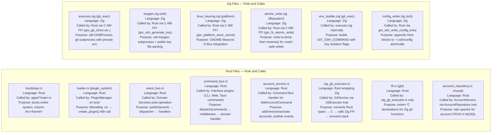

---

## 12. Full Request Lifecycle Flows

### Flow 1: `git-manager clone https://github.com/user/repo --account work`

This flow shows Rust handling the high-level orchestration and Zig handling the actual Git subprocess with SSH environment isolation.

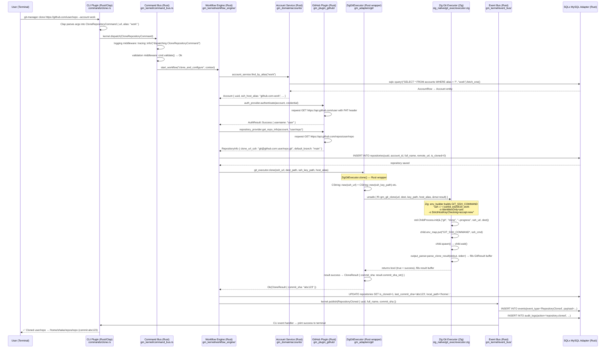

### Flow 2: `git-manager push` — the Zig SSH environment in action

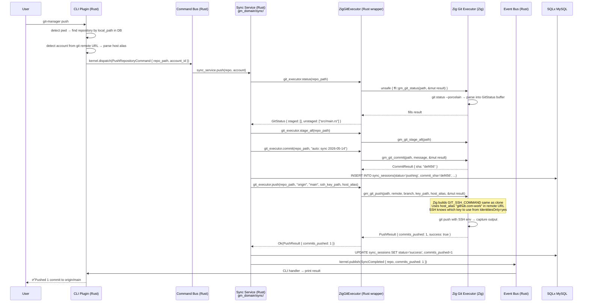

### Flow 3: Adding an account — SSH key generation via Zig, credential storage via Zig platform layer

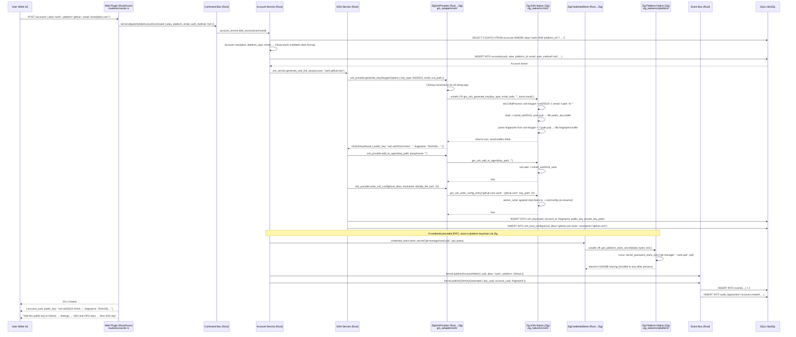

---

## 13. Database Relationship Map

The MySQL schema is unchanged from the original design. The Zig layer reads and writes no data directly — it only performs OS-level operations. All persistence goes through the Rust SQLx adapters.

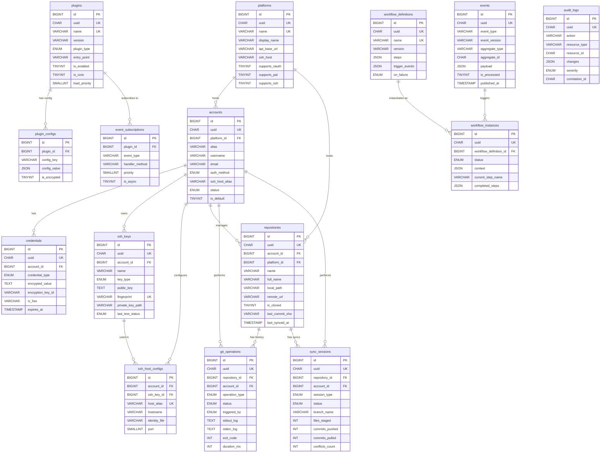

---

## 14. Event Flow Map

Events flow identically to the original design. The Zig layer never publishes events — it performs OS operations and returns results. Events are always published by Rust domain services after a successful operation is confirmed.

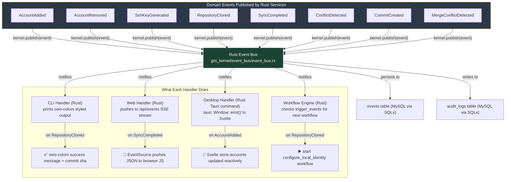

---

## Architecture Rules — All Enforced

Seven rules govern this codebase. The first five are enforced by the Rust compiler through the crate dependency graph. The last two require discipline.

**Rule 1 — Domain imports nothing external.** `gm_domain/Cargo.toml` lists only `gm_shared`, `serde`, `uuid`, `chrono`, and `async-trait`. If domain code tries to import `sqlx`, the workspace build fails before a single test runs.

**Rule 2 — Ports, not direct calls.** Domain code never imports an adapter. It calls a trait method. The kernel wires the concrete `ZigGitExecutor` or `MySqlAccountRepository` at bootstrap time.

**Rule 3 — Kernel stays small.** If a feature requires adding business logic to the kernel, it belongs in the domain or a plugin instead. The kernel should feel boring — routing, lifecycle, contracts only.

**Rule 4 — Plugins communicate only through contracts.** No plugin imports another plugin's internal modules. Plugin-to-plugin communication happens through events or through services registered in the service registry by name.

**Rule 5 — Interface plugins are thin.** A CLI command does exactly two things: validate user input and dispatch a command. All logic lives in the domain. No git operations, no SSH operations, no business rules in `commands/*.rs`.

**Rule 6 — Zig owns only the OS boundary.** Zig files contain no business logic. A Zig function that generates an SSH key does not decide what key type to use — that decision is made by the Rust domain service which passes the key type as a parameter. Zig executes the OS operation and reports the result. Period.

**Rule 7 — The FFI boundary is always wrapped.** No code outside `gm_adapters/src/*/zig_*.rs` ever calls an `extern "C"` function. Every Zig FFI call is wrapped in a safe Rust function that converts from C types to Rust types and from C error codes to `Result<T, E>`. The rest of the codebase sees only safe Rust.

---

*Architecture: Microkernel + Hexagonal Core. Language stack: Rust (core + adapters + plugins + interfaces) + Zig (native OS layer, libgm_native.a) + TypeScript/Svelte (desktop frontend). This document is the source of truth.*